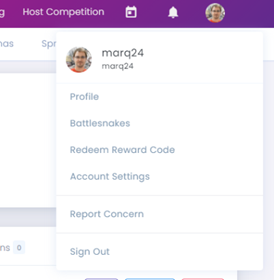
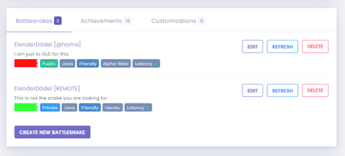
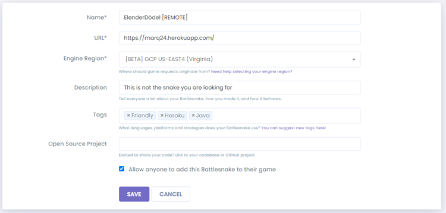

# Short Introduction into the game

Matthias G. was so kind to introduce the “Battlesnake Challange” - it is fee & open for everyone. The challenge is
to provide a public reachable webserver that can reply to four different requests: “info”, “start, “move” and “end”. You
can choose any language you like to reply to the incoming POST requests in less than 500ms. In theory also a manual
request processing is possible. There are some simple rules of the game: https://docs.battlesnake.com/references/rules

## Requirements to be able to participate

1. Battlesnake Account (free)
2. GitHub Account (to clone a repro)
3. Heroku account (simple way to host your webserver/application for free with an acceptable performance) - this is
   optional – if you have other possibilities to host a webserver you are free to do so!

## How to Start?

Once you created your BattleSnake Account @ https://play.battlesnake.com/ you can jump into the action by go
through https://docs.battlesnake.com/references/starter-projects. Old men like my (marq24) wight like the Java package –
so then you can follow the instructions in this link: https://github.com/battlesnakeofficial/starter-snake-java
Basically, clone the repro, install Heroku CLI (or the Heroku npm CLI), create the app @ Heroku and push it.

### Installing Heroku CLI

See https://statics.teams.cdn.office.net/evergreen-assets/safelinks/1/atp-safelinks.html

#### Install npm cli

`npm install -g heroku`

### Deploying Your First JAVA Battlesnake with Heroku

1. [Fork this repo](https://github.com/BattlesnakeOfficial/starter-snake-java/fork) into your GitHub Account.
2. Clone your forked repo into your local environment.<br/>
   `git clone git@github.com:[YOUR-GITHUB-USERNAME]/starter-snake-java.git`
3. [Create a new Heroku app](https://devcenter.heroku.com/articles/creating-apps) to run your
   Battlesnake.<br/>`heroku create [YOUR-APP-NAME]`
4. [Deploy your Battlesnake code to Heroku](https://devcenter.heroku.com/articles/git#deploying-code).<br/>
   `git push heroku master`
5. Open your new Heroku app in your browser.<br/>`heroku open`
6. If everything was successful a browser window will open and you should see the following
   text<br/>`{"tailType":"default","color":"#888888","headType":"default","author":"","apiversion":"1"}`
7. Optionally, you can view your server logs using
   the [Heroku logs command](https://devcenter.heroku.com/articles/logging#log-retrieval)<br/>
   `heroku logs –-tail`<br/>
   or<br/>
   `heroku logs –t –s app`<br/>
   The --tail option will show a live feed of your logs in real-time. At this point your Battlesnake is live and ready
   to enter games!

### Updating Your Battlesnake with Heroku

After making changes, commit them using git and deploy your changes to Heroku.

```
git add .
git commit -m "update my battlesnake's appearance"
git push heroku master
```

Once Heroku has updated you can create a new game with your Battlesnake to view your latest changes in action.

### Register your Heroku Snake-Server @ Battlesnake

1. At the Battlesnake website click on the upper right corner on your user icon<br/>
   
2. Select the menu Item “Battlesnakes”
3. Press the “create new Battlesnake” Button<br/>
   <br/>
4. Now you enter/specify:<br/>
   <br/>
    - Any Name you like for your snake
    - The URL where your snake app is hosted (here in this example my Heroku app @ https://marq24.herokuapp.com/ (that’s
      the one the heroku open command will open)
    - _**IMPORTANT**_ Select as Engine Region ’[BETA] GCP US-EAST4 (Virgina) we have the feeling its a little faster =)
    - _**IMPORTANT**_ Check ”Allow anyone to add this Battlesnake to their game”

5. Please be so kind and add your Snake information to our Teams [OT] Battlesnake Channel’s “BattleSnakes List”

Now you can start to adjust the code and start the first challenges! https://play.battlesnake.com/challenges/
- Avoid Walls
- Avoid Yourself
- Avoid Others

## Useful additional documentation

- https://docs.battlesnake.com/references/api
- https://docs.battlesnake.com/references/api/sample-move-request
- The board layout:

## Typical pitfalls

#### _Your code changes do not have any effect on the game/logs:_<br/>

Check, if you have comit your code and pushed to the remote heroku master

#### _You changed the color/shape of your snake – but your snake will not get updated on BattleSnake_<br/>

Open the Battlesnake Website, Select the ‘battlesnakes’ item from your user icons menu, select your snake and press the
‘update’ button

#### _The board grid starts in the LOWER LEFT_

#### _`Heroku logs –t` can lose the connection – you might need the CTRL-C it and just restart it_

#### _You lose a game and do not have a singly clue why?_<br/>

Welcome to my world 😀 for me (marq24) logging was the key. You might like to check my very
simple [‘replayGameWithId’ Test @github](https://github.com/marq24/doedel-snake/blob/0e2c02eaf9b4e0d2f1294c5ebd9d7ad67af93ec8/src/test/java/com/emb/bs/ite/SnakeTest.java#L105).

### Some personal remarks

This is about having fun – each match can be shared – allowing others to admire genius moves of your snake as well as
laugh about not so smart ones... At the end of the day, it is the discussion about coding, different approached and talk
about failing and mastering different challenges of the game. Of course, you just can copy & paste code somewhere form
the internet and build the SnakeOverloard – that is fine... but before you reinvent the wheel just have a look
here: https://aws.amazon.com/de/blogs/machine-learning/building-an-ai-powered-battlesnake-with-reinforcement-learning-on-amazon-sagemaker/ [found by Tim W.]
